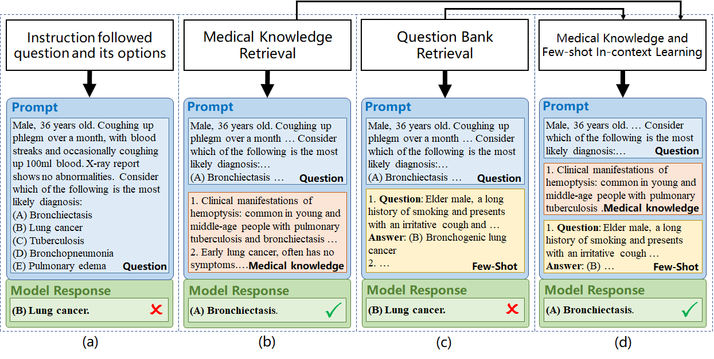
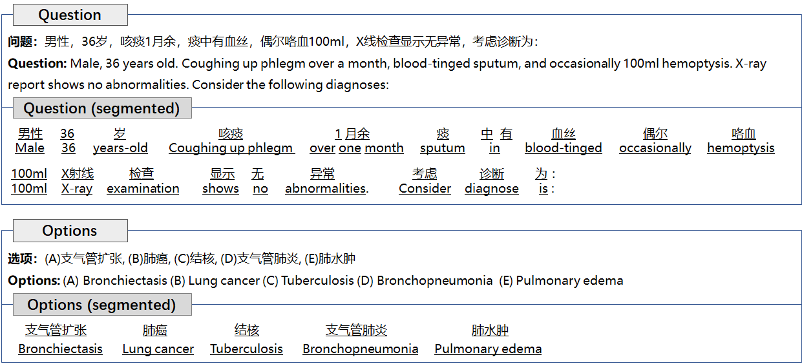

# Large Language Models Leverage External Knowledge to Extend Clinical Insight Beyond Language Boundaries

This repository contains the code and resource for the paper:

**[Large Language Models Leverage External Knowledge to Extend Clinical Insight Beyond Language Boundaries](https://arxiv.org/abs/2305.10163)**

**Authors**: Jiageng Wu, Xian Wu, Zhaopeng Qiu, Minghui Li, Yingying Zhang, Yefeng Zheng, Changzheng Yuan, and Jie Yang

**Formerly named as:** Qualifying Chinese Medical Licensing Examination with Knowledge Enhanced Generative Pre-training Model

## TL;DR

This framework efficiently enhance LLMS's performance on clinical question by leveraging external medical knowledge and relevant historical questions, enabling various LLMs passing the Chinese National Medical Licensing Examination at high scores.

## Introduction

The rapidly evolving large language models (LLMs) such as ChatGPT are promising to serve as versatile medical assistants, capable of analyzing healthcare problems and providing insightful suggestions in a more user-friendly manner, especially for those with limited medical resources. However, current advanced LLMs are predominantly trained and validated on general, English-centric data, lacking adaptation to linguistic diversity and specialized domains, especially for knowledge-intensive clinical settings. The inflexibility and prohibitive cost of re-training pose significant barriers to effectively benefiting the global population, potentially exacerbating healthcare inequity. Moreover, recent studies highlighted a marked performance decline of LLMs in non-English medical scenarios and raised concern about the potential bias brought by the under-represented data.

To address these challenges, our study explores the optimal practices to bridge the knowledge gap and enhance the capabilities of LLMs in non-English medical scenarios. We proposed a novel framework that leverages the in-context learning ability of LLMs to incorporate diverse external clinical knowledge sources. Exemplified with Chinese medical licensing examination, the framework significantly bolstered LLM’s performance without additional training or fine-tuning. Remarkably, ChatGPT’s performance in the CNMLE surged from 51.01 to 70.04, while GPT-4 achieved an expert-level score of 82.59 and a smaller 13B model also qualified for the examination. Furthermore, extensive analysis and ablation studies were conducted to systematically investigate the effectiveness of various pathways from seven perspectives. Overall, it provides practical guidance for extending clinical insights beyond language barriers in healthcare, substantially reducing language-related discrepancies in the application of LLMs.

## Methodlogy

### The overall workflow

Given the question stem and five candidate options, KFE retrieves the relevant knowledge from a comprehensive knowledge base and identifies similar questions from a historical question bank. The integrated prompt consists of specific instructions, pertinent knowledge, exemplar cases, and a testing question. Benefiting from the LLM’s in-context learning capabilities, KFE extends the clinical insight of LLM in non-English settings and bridges the language barriers in healthcare applications. Finally, LLM generates a predicted answer


<div align='center' >
    <p><strong>
    Figure 1.Workflow of knowledge and few-shot enhancement framework (KFE).
    </strong></p>
</div>

As show Figure 2 below, (a) list a basic form of prompt that includes the question and options; (b) further includes retrieved related medical knowledge which is in the form of text pieces; (c) includes retrieved pairs of questions and answers as few-shot examples; (d) includes both retrieved knowledge and few-shot examples in prompts.


<div align='center' >
    <p><strong>
    Figure 2. The integrated prompt of different enhancements in KFE.
    </strong></p>
</div>

### Case study

As illustrated in Figure 2 and Figure 3, We have added the detailed case studies of inference generated by GPT-3.5 under the Basic setting and KEF framework, which explicitly presented the detailed reasoning process. In the zero-shot setting, without any support, GPT-3.5 generated the hallucination that "Bronchiectasis generally does not present with hemoptysis," leading to an incorrect diagnosis. Amidst the support of KFE, knowledge enhancement provided relevant information about the common causes of hemoptysis, while few-shot enhancement provided examples showcasing typical X-ray findings associated with lung cancer. The comprehensive KEF empowers GPT-3.5 to integrate essential rationales derived from both knowledge and few-shot enhancements, thereby generating critical cognition needed for problem-solving and ultimately determining the correct diagnosis. Consequently, GPT-3.5 could accurately deduce the correct answer by correlating the patient’s clinical manifestations and age


<div align='center' >
    <p><strong>
    Figure 3. A case study of inference generated by GPT-3.5 under the basic setting.
    </strong></p>
</div>


<div align='center' >
    <p><strong>
    Figure 4: A case study of inference generated by GPT-3.5 under the KFE framework
    </strong></p>
</div>

### More details

The detailed methodlogy, result and discussion can be found in our [paper](https://arxiv.org/abs/2305.10163).

## Code and Resource

### Overall

Since our resrach involves multiple models and multiple enhancement strategies, we recommend that we generate the enhanced input and then evaluate it by LLMs.

For example, we can first retrieve the relevant medical knowledge from medical textbooks and search the similar questions from question bank, respectively. Then, we can merge it construct the completed KFE or validate its effectiveness individually.

### Word Segementation

The examplified code in /code/Word_segementation.ipynb, which directly shows the process of word segementaion enhanced with medical lexicon.

Unlike English, where words are naturally segmented, Chinese texts necessitate word segmentation to identify words. For example, the term "支气管扩张" signifies "Bronchiectasis" as a unified concept, but separating it into single characters-"支", "气", "管", "扩", and "张"-disrupts their inherent clinical significance. To address this, we integrated a medical lexicon in word segmentation. which effectively divides sentences by recognizing both general Chinese vocabulary and specialized medical terminologies. This segmentation allows us to model the entire corpus, extract keyword representations of sentences, and retrieve clinically relevant knowledge or examples from large-scale candidates.



<div align='center' >
    <p><strong>
    Figure 5: A case study of the segmented question and options.
    </strong></p>
</div>

### Knowledge Enhancement

Code in /code/Knowledge enhancement/.

The notebook directly demonstrates the whole workflow. .

Due to the time-consuming process of retrieval for all data, the Retrieval_knowledge.py ultilizes the multithread to acceralate the process

### Few-shot Enhancement

Code in /code/Few-shot enhancement/.

The notebook directly demonstrates the whole workflow. .

Due to the time-consuming process of retrieval for all data, the Retrieval_question.py ultilizes the multithread to acceralate the process

### Applying LLM in CNMLE

The notebooks provide the examplified code for evaluating Baichuan2, QWEN, ChatGPT(GPT-3.5) and GPT-4.

**Note:**
Due the copyright and privacy restrictions, we can not directly share the medical books and historical examinations. But our framework can be easily adapted to various medical resources. Currently, there are some publicly available datasets for medical knowledge and questions, which can be used as candidate supports.
In this repo, we selected the widely used [MedQA ](https://github.com/jind11/MedQA)as the resources of medical textbooks and historical questions.

## Cite

If you use code in our repo,  please cite our [paper](https://arxiv.org/abs/2305.10163):

```
@misc{llm-cnmle-2024,
      title={Large Language Models Leverage External Knowledge to Extend Clinical Insight Beyond Language Boundaries}, 
      author={Jiageng Wu and Xian Wu and Zhaopeng Qiu and Minghui Li and Yingying Zhang and Yefeng Zheng and Changzheng Yuan and Jie Yang},
      year={2024},
      eprint={2305.10163},
      archivePrefix={arXiv},
      primaryClass={cs.CL}
}
```

## Contact

If you have any questions about our work, please feel free to contact us! (Jiageng Wu, [wujg1995@163.com](wujg1995@163.com))
